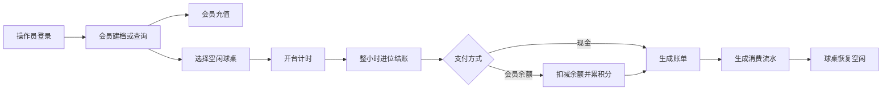
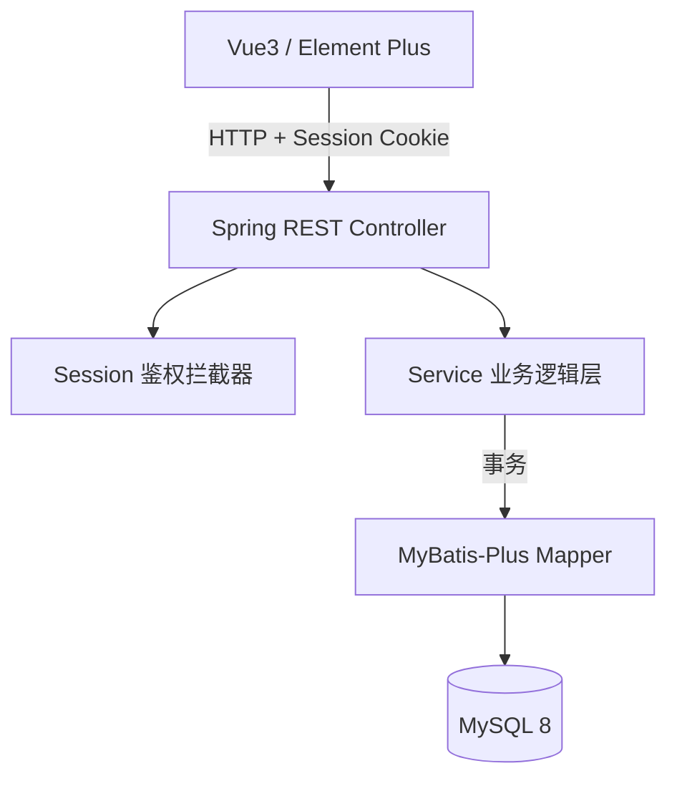
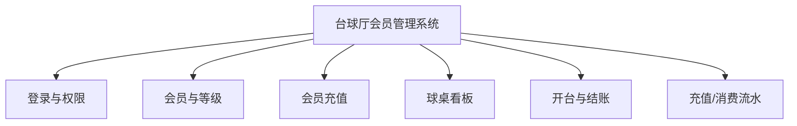
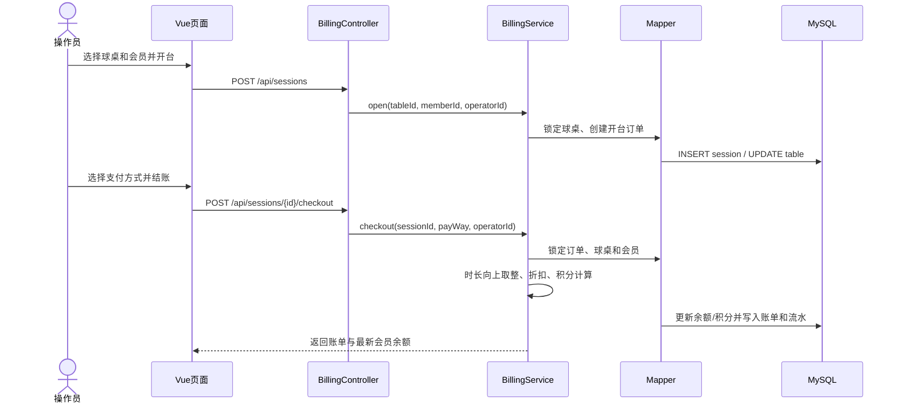
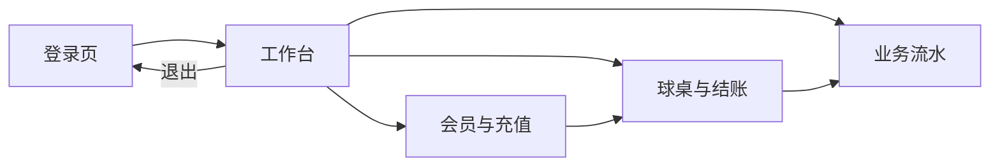
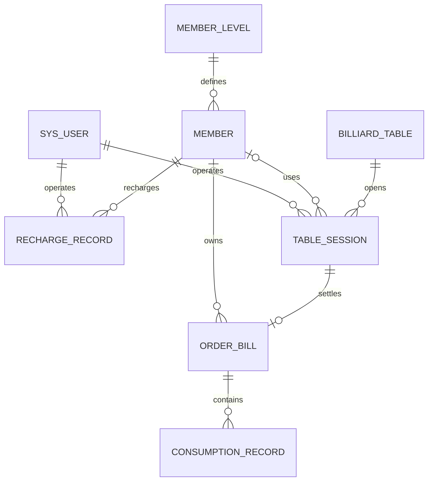

# 台球厅会员管理系统 —— 需求分析与详细设计说明书

> 提交时按课程要求改名：**组号+详细设计说明书（备注成员姓名）.pdf**
> 本文档与当前可运行版本同步。图表使用 Mermaid 描述，提交 PDF 前可直接渲染或导出为图片。

---

## 1. 引言

### 1.1 编写目的

说明本文档的作用（指导编码阶段的系统实现），读者对象（指导教师、开发小组成员）。

### 1.2 项目背景

台球厅在日常经营中存在会员管理混乱、计费不透明、充值/消费记录不清晰等问题。本系统实现会员建档、充值、开台计时计费、结账折扣与流水管理的一体化，提升台球厅运营效率。

### 1.3 术语定义

| 术语 | 说明 |
|---|---|
| 开台 | 顾客开始使用球桌，系统开始计时 |
| 结账 | 结束使用，按「时长 × 单价 × 会员折扣」结算 |
| 挂账 | 顾客暂不付款，记账后下次结清（扩展） |
| 积分 | 消费累积的权益值，用于会员升级 |

---

## 2. 需求分析【做什么】

### 2.1 系统角色识别

| 角色名称 | 说明 |
|---|---|
| ba_管理员（老板） | 拥有全部权限：会员/等级/球桌管理、充值、开台结账、员工账号、统计报表 |
| ba_前台 | 日常操作：会员建档、充值、开台结账、流水查询（无报表/员工管理权限） |
| ba_会员 | 查询余额/积分/消费记录（本课程第一阶段以管理员端为主，会员自助端为扩展） |

### 2.2 功能性需求概览（业务概览）

- 会员管理业务
- 会员充值业务
- 开台业务
- 结账计费业务
- 流水查询业务
- 统计报表业务（扩展）



### 2.3 功能性需求规定（用例描述）
>
> 参照课程模板，每个用例给出：用例名称、实现名称、参与者、前置条件、后置条件、主事件流、备选事件流。

#### 用例 1：bu_开台

- **参与者**：前台 / 管理员
- **前置条件**：操作员已登录；存在空闲球桌
- **后置条件**：创建开台订单，球桌状态置为「使用中」
- **主事件流**：
  1. 操作员选择空闲球桌，点击「开台」
  2. 系统记录开台时间，生成开台单号
  3. （可选）操作员绑定会员
  4. 系统将球桌状态置为「使用中」，用例结束
- **备选事件流**：
  1.a 球桌非空闲 → 提示「该桌不可开台」，用例结束

#### 用例 2：bu_结账

- **参与者**：前台 / 管理员
- **前置条件**：存在进行中的开台订单
- **后置条件**：生成结账单，更新球桌状态为「空闲」，会员余额/积分更新
- **主事件流**：
  1. 操作员选择进行中的订单，点击「结账」
  2. 系统按「时长 × 单价」计算原价
  3. 若绑定会员，系统按会员等级折扣计算优惠与实收金额
  4. 操作员选择支付方式（现金/会员余额/挂账），确认结账
  5. 系统扣减会员余额（如用余额支付）、累加积分、更新球桌状态，生成结账单与消费流水，用例结束
- **备选事件流**：
  4.a 会员余额不足 → 提示余额不足，可改现金支付
  4.b 取消结账 → 回到主界面，订单保持进行中

#### 用例 3：bu_会员充值

- **参与者**：前台 / 管理员
- **前置条件**：会员已建档且状态正常
- **后置条件**：会员余额增加，生成充值记录
- **主事件流**：
  1. 操作员查询会员
  2. 输入充值金额，选择支付方式
  3. 系统按规则计算赠送金额，更新余额，生成充值记录，用例结束

#### 用例 4：bu_会员建档

- **参与者**：前台 / 管理员
- **前置条件**：操作员已登录
- **后置条件**：创建会员档案，生成唯一卡号
- **主事件流**：
  1. 操作员录入姓名、手机号、初始等级
  2. 系统生成唯一卡号，保存会员，用例结束
- **备选事件流**：
  1.a 手机号/卡号重复 → 提示已存在

#### 用例 5：bu_会员查询与维护

- **参与者**：前台 / 管理员
- **前置条件**：操作员已登录
- **主事件流**：按姓名、手机号或卡号分页查询，查看余额、积分和等级；可编辑资料或启停会员。
- **备选事件流**：会员存在进行中的开台订单时，系统拒绝停用。

#### 用例 6：bu_球桌维护

- **参与者**：管理员
- **前置条件**：管理员已登录；球桌未在使用中
- **主事件流**：管理员将空闲球桌设为维护并填写原因，维护完成后恢复空闲。
- **备选事件流**：前台账号操作时返回无权限；使用中的球桌拒绝修改。

#### 用例 7：bu_流水查询

- **参与者**：前台 / 管理员
- **前置条件**：操作员已登录
- **主事件流**：分页查询充值流水或消费流水，可按会员、卡号、充值单号或账单号检索。

### 2.4 业务实体分析

核心实体：会员（Member）、会员等级（MemberLevel）、球桌（BilliardTable）、开台订单（TableSession）、结账单（OrderBill）、充值记录（RechargeRecord）、消费流水（ConsumptionRecord）、系统用户（SysUser）。

实体之间以会员、球桌开台订单和账单为主线：会员属于一个等级；开台订单绑定球桌、可选绑定会员；结账单对应一个开台订单；充值和消费分别形成独立流水。

### 2.5 非功能性需求

- **性能**：支持约 50 名并发操作员，普通查询响应时间 ≤ 2s。
- **安全**：密码 MD5 加密存储（可升级为 BCrypt）；基于角色的功能权限控制；关键操作记录操作员。
- **外部接口**：预留会员余额支付、微信/支付宝扫码支付接口（扩展）。

---

## 3. 系统设计【怎么做】

### 3.1 软件架构设计（MVC）

基于 MVC 的三层架构：

```
表示层  Vue3 + Element Plus  ↔  Spring Boot Controller（REST）
业务逻辑层  Service / ServiceImpl（计费、折扣、积分、权限）
数据访问层  MyBatis-Plus Mapper（SQL、CRUD、关联查询）
数据库  MySQL 8
```

辅助类：`Result<T>`（统一返回体）、`PageResult<T>`（分页）、`BusinessException` + `GlobalExceptionHandler`（统一异常）、`MybatisPlusConfig`（分页插件）、工具类（金额/时间/MD5）。



### 3.2 功能模块设计

| 模块 | 功能点 | Controller | Service | Mapper | 页面 |
|---|---|---|---|---|---|
| 登录权限 | 登录、登出、角色控制 | AuthController | AuthService | SysUserMapper | Login.vue |
| 会员管理 | 建档/编辑/查询/停用 | MemberController | MemberService | MemberMapper | Member.vue |
| 等级管理 | 等级/折扣/升级规则 | LevelController | LevelService | MemberLevelMapper | Level.vue |
| 充值管理 | 充值、赠送 | RechargeController | RechargeService | RechargeRecordMapper | Recharge.vue |
| 球桌管理 | 桌列表/状态/维护 | TableController | TableService | BilliardTableMapper | Table.vue |
| 开台结账 | 开台/结账/计费/折扣 | BillingController | BillingService | TableSessionMapper / OrderBillMapper | Billing.vue |
| 流水查询 | 充值/消费流水 | RecordController | RecordService | RechargeRecordMapper / ConsumptionRecordMapper | Record.vue |
| 统计报表 | 营业额/利用率（扩展） | ReportController | ReportService | 各 Mapper 聚合 | Report.vue |



### 3.3 关键业务序列图



### 3.4 用户界面设计

- 登录页、主框架（侧边栏菜单）、会员列表/编辑、球桌看板（空闲/使用中/维护卡片）、开台结账页、充值页、流水查询页。



### 3.5 数据库设计

#### 3.5.1 逻辑结构设计（E-R 图）



#### 3.5.2 物理结构设计（表结构）

完整建表语句见 `database/init.sql`，共 8 张表：

| 表名 | 说明 | 主要字段 |
|---|---|---|
| sys_user | 系统用户 | id, username, password, role, status |
| member_level | 会员等级 | id, name, discount, points_threshold |
| member | 会员 | id, card_no, name, phone, level_id, balance, points, status |
| billiard_table | 球桌 | id, table_no, table_type, price_per_hour, status |
| table_session | 开台订单 | id, session_no, table_id, member_id, start_time, end_time, status |
| order_bill | 结账单 | id, bill_no, session_id, member_id, duration_hours, original_amount, discount_rate, discount_amount, final_amount, pay_way, points_earned |
| recharge_record | 充值记录 | id, record_no, member_id, amount, gift_amount, pay_way |
| consumption_record | 消费流水 | id, member_id, bill_id, type, item_name, amount |

关键约束如下，完整字段类型和建表语句以 `database/init.sql` 为准：

| 表 | 主键 | 唯一约束 | 主要外键 |
|---|---|---|---|
| sys_user | id | username | - |
| member_level | id | - | - |
| member | id | card_no、phone | level_id → member_level |
| billiard_table | id | table_no | - |
| table_session | id | session_no | table_id、member_id、operator_id |
| order_bill | id | bill_no | session_id、member_id、operator_id |
| recharge_record | id | record_no | member_id、operator_id |
| consumption_record | id | - | member_id、bill_id |

### 3.6 REST 接口设计

| 模块 | 方法与路径 | 说明 |
|---|---|---|
| 鉴权 | POST `/api/auth/login` | 校验账号并创建 Session |
| 鉴权 | GET `/api/auth/me`、POST `/api/auth/logout` | 恢复会话、退出登录 |
| 会员 | GET/POST `/api/members`、PUT `/api/members/{id}` | 查询、建档、编辑 |
| 会员 | PATCH `/api/members/{id}/status` | 启停会员 |
| 充值 | POST `/api/members/{id}/recharges` | 事务更新余额并生成充值单 |
| 球桌 | GET `/api/tables`、PATCH `/api/tables/{id}/status` | 看板与管理员维护 |
| 计费 | POST `/api/sessions` | 开台并占用球桌 |
| 计费 | POST `/api/sessions/{id}/cancel` | 取消开台并释放球桌 |
| 计费 | POST `/api/sessions/{id}/checkout` | 整小时进位结账 |
| 流水 | GET `/api/records/recharges`、`/consumptions` | 分页检索两类流水 |

---

## 4. 非功能性设计说明

- 统一异常处理与统一返回体；未登录返回 HTTP 401，非管理员操作返回 HTTP 403。
- 关键业务使用数据库事务和行锁，避免重复开台、重复结账和余额并发扣减。
- 当前演示数据沿用 MD5 密码以兼容课程初始库；正式系统应升级为 BCrypt 并将数据库密码移出源码。
- 后端提供 H2 内存数据库集成测试，不会污染本机 MySQL 业务数据。

## 5. 团队分工（阶段一填写）

| 成员 | 负责模块 | 备注 |
|---|---|---|
| 组长 A（提交前替换真实姓名） | 架构、数据库、会员/等级/充值、文档整合 | 负责合并与最终交付 |
| 成员 B（提交前替换真实姓名） | 球桌、开台、结账与计费算法 | 负责核心计费演示 |
| 成员 C（提交前替换真实姓名） | 登录权限、流水、前端公共布局与测试 | 负责鉴权和公共组件 |

---

## 6. 测试设计

- 登录：正确密码、错误密码、停用账号、匿名访问、角色越权。
- 会员：建档、重复手机号、分页检索、进行中订单会员停用保护。
- 充值：正金额校验、余额与充值记录同事务更新。
- 开台：空闲桌成功，维护桌或使用中球桌失败。
- 结账：1 分钟、60 分钟、61 分钟边界；现金/余额；余额不足回滚；账单、积分、流水和球桌状态一致。
- 构建：`mvn test`、`mvn package`、`npm run build` 均成功后才能生成提交包。
